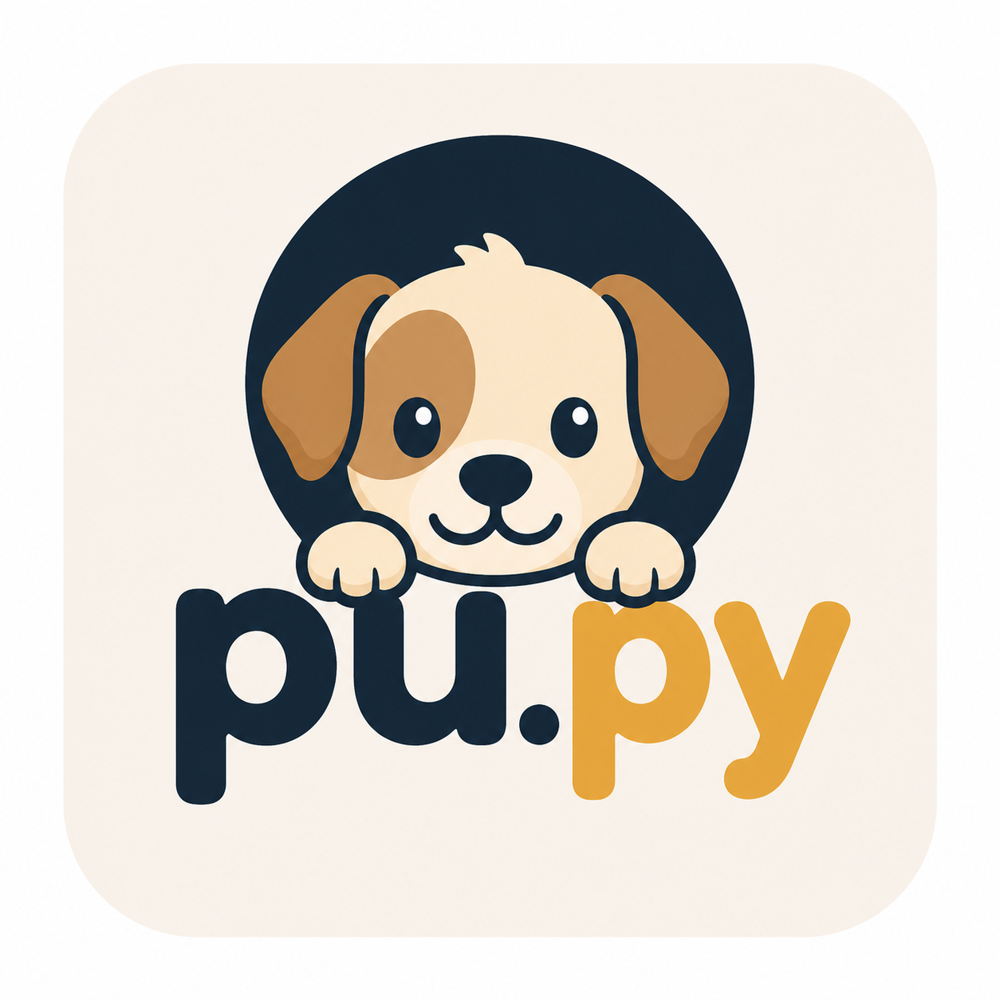

# pu.py



**Portable agentic harness** — A Python port of [pu.sh](https://github.com/NahimNasser/pu) that provides an intelligent coding assistant with tool-calling capabilities.

## Features

- **Multi-provider support**: Works with OpenAI, Anthropic, and OpenCode APIs
- **Agentic tools**: bash, read, write, edit, grep, find, ls
- **Interactive mode**: Chat with your AI assistant
- **Pipe mode**: `./pu.py --pipe` for CI/automation
- **Token & cost tracking**: Monitor usage in real-time
- **Session persistence**: Resume conversations across sessions
- **Context management**: Automatic compaction and token management
- **Configurable**: Extensive environment variable support

## Quick Start

```bash
# Make executable
chmod +x pu.py

# Run with a task
./pu.py "list all Python files in this directory"

# Interactive mode
./pu.py

# Pipe mode (for CI/automation)
echo "review this code" | ./pu.py --pipe

# Show cost tracking
./pu.py --cost "optimize this function"
```

## Configuration

Create `~/.pu.env` for persistent configuration:

```bash
export ANTHROPIC_API_KEY="your-key-here"
export OPENAI_API_KEY="your-key-here"
export OPENCODE_API_KEY="public"
export AGENT_PROVIDER="anthropic"        # or "openai", "opencode"
export AGENT_MODEL="claude-opus-4-7"     # or "gpt-5.5", "big-pickle"
export AGENT_EFFORT="medium"              # low, medium, high, xhigh, max
export AGENT_MAX_STEPS="100"
export AGENT_MAX_TOKENS="4096"
export AGENT_CONTEXT_LIMIT="400000"
export AGENT_VERBOSE="1"
```

## Environment Variables

| Variable | Description | Default |
|----------|-------------|---------|
| `ANTHROPIC_API_KEY` | Anthropic API key | - |
| `OPENAI_API_KEY` | OpenAI API key | - |
| `OPENCODE_API_KEY` | OpenCode API key | `public` |
| `AGENT_PROVIDER` | AI provider | auto-detect |
| `AGENT_MODEL` | Model to use | provider-specific |
| `AGENT_EFFORT` | Reasoning effort | `medium` |
| `AGENT_MAX_STEPS` | Max agent steps | `100` |
| `AGENT_MAX_TOKENS` | Max tokens per response | `4096` |
| `AGENT_CONTEXT_LIMIT` | Context window size | `400000` |
| `AGENT_LOG` | Event log file | `.pu-events.jsonl` |
| `AGENT_HISTORY` | History file | `.pu-history.json` |
| `AGENT_VERBOSE` | Verbose output | `1` |
| `AGENT_CONFIRM` | Confirmation mode | `0` |
| `AGENT_RESERVE` | Token reserve | `16000` |
| `AGENT_KEEP_RECENT` | Recent tokens to keep | `80000` |
| `AGENT_TOOL_TRUNC` | Tool output truncation | `100000` |
| `AGENT_READ_MAX` | Max file read size | `1000000` |
| `AGENT_PRICE_IN_PER_MTOK` | Input token price | `0` |
| `AGENT_PRICE_OUT_PER_MTOK` | Output token price | `0` |

## Interactive Commands

When running in interactive mode, use these commands:

- `/model [name]` — Switch AI model
- `/effort` — Change reasoning effort
- `/login` / `/logout` — Manage API keys
- `/flush` — Clear conversation history
- `/compact` — Compact context
- `/export` — Export conversation
- `/session` — Show session info
- `/quit` — Exit
- `!cmd` — Run shell command directly

## Supported Models

### Anthropic
- `claude-opus-4-7` (default for Anthropic)
- `claude-sonnet-4-6`
- `claude-opus-4-6`
- `claude-opus-4-5`

### OpenAI
- `gpt-5.5` (default for OpenAI)
- `o1`, `o3`, `o4` series

### OpenCode
- `big-pickle` (default for OpenCode)
- `minimax`
- `glm`
- `qwen`
- `kimi`

## Requirements

- Python 3.7+
- Internet connection
- API key for your chosen provider

## License

MIT
